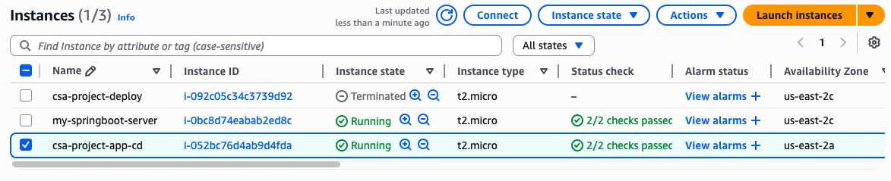
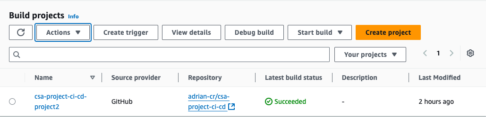
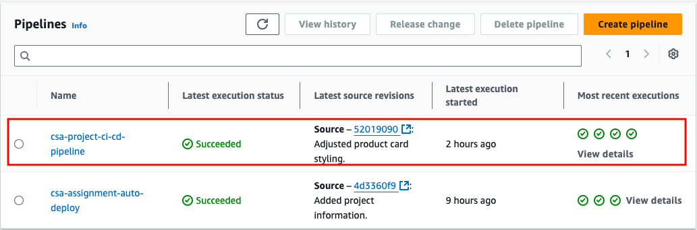
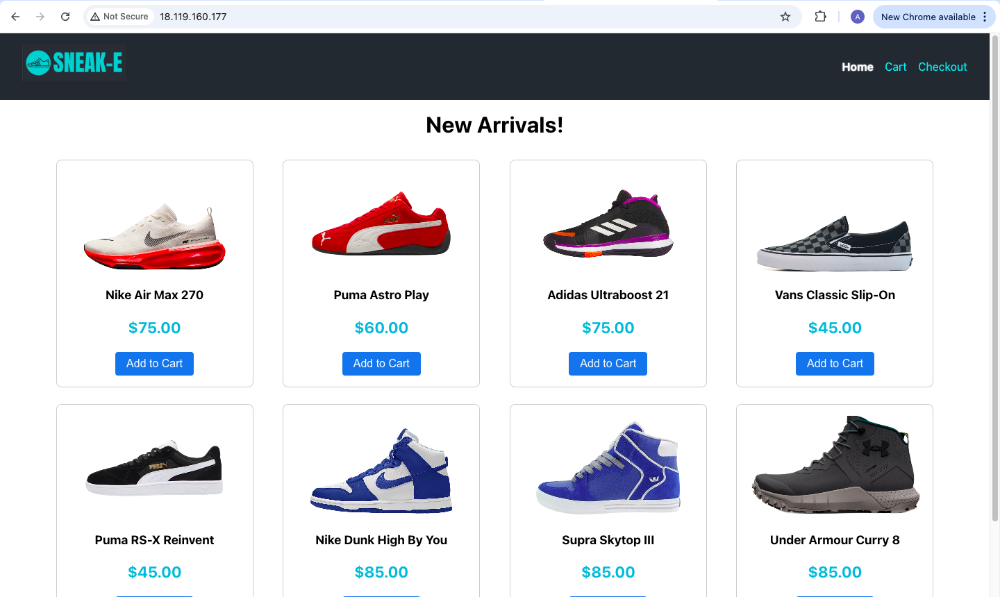
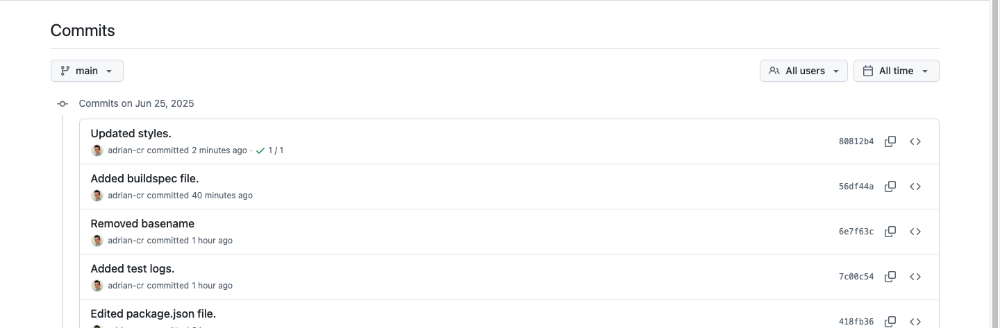
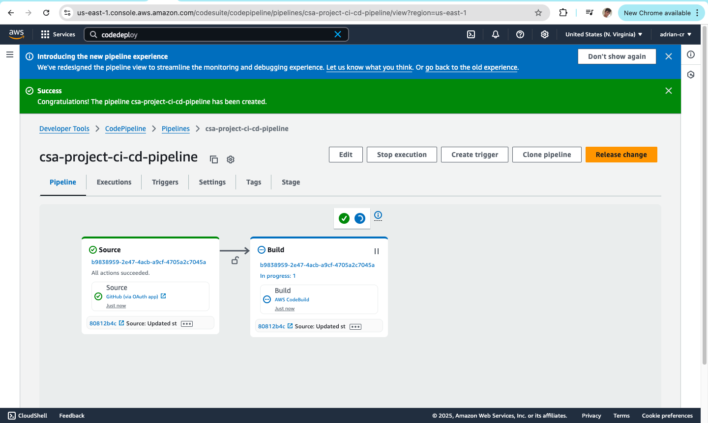
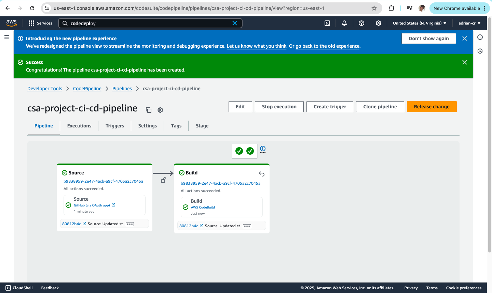
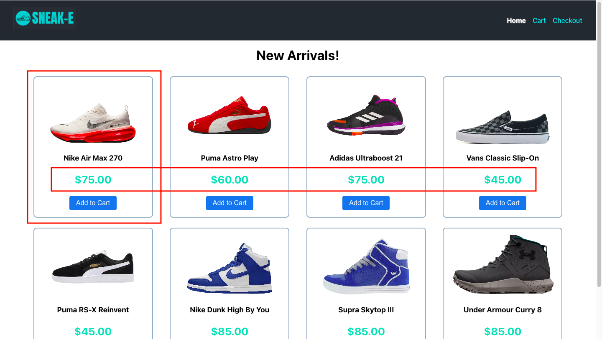

# Project: Continuous Deployment System
For this project, I have hosted, deployed, and implemented a CD system for a `React` app using multiple AWS services.

## Technologies Used
* `EC2`
* `Nginx`
* `GitHub`
* `CodeBuild`
* `CodePipeline`

## Setup
To build this project, I took the following steps:

### 1. Host `React` App on `GitHub`
I created this new repository, cloned it locally and added the files for a previous `React` project (see original project [here](https://github.com/adrian-cr/csa-project-shopping-cart-app)). I then pushed all changes to GitHub.


### 2. Set Up an `EC2` Instance
To create, configure and host my application in a `EC2` instance, I did the following:

1. Create a new `EC2` instance from the AWS console:

    

    **Additional inbound traffic rules were attached to allow access to/from my local IP.*


2. Install all necessary software for properly hosting the React application:
    * `Node.js`
    * `npm`
    * `git`
    * `nginx`

3. Create a dedicated folder for the application's build files:

      ```bash
      sudo mkdir -p /var/www/vhosts/frontend/build
      ```
4. Clone the repository into the instance:
      ```bash
      sudo git clone https://github.com/adrian-cr/csa-project-ci-cd.git
      ```
5. Install all necessary dependencies and run the app's build script:
      ```bash
      sudo npm i && sudo npm run build
      ```
6. Upload the contents of the `build/` folder to the dedicated directory.

7. Edit `nginx` configuration:
   ```bash
   sudo vim /etc/nginx/nginx.conf
   ```
   ```nginx
   events {}

   http {
       include       mime.types;
       default_type  application/octet-stream;

       server {
           listen 80 default_server;
           server_name _;

           root /var/www/vhosts/frontend/build;
           index index.html;

           location / {
               try_files $uri /index.html;
           }

           location ~* \.(js|css|png|jpg|jpeg|gif|ico|svg|woff|woff2|ttf|eot|map)$ {
               expires 1y;
               add_header Cache-Control "public";
           }
       }
   }
   ```

7. Restart `nginx`:
   ```bash
   sudo systemctl restart nginx
   ```

8: Add a `buildspec.yml` file to the project root for `CodeBuild` project:

```yaml
version: 0.2

phases:
  install:
    runtime-versions:
      nodejs: 18
    commands:
      - npm install
  build:
    commands:
      - npm run build

post_build:
  commands:
    - echo "$EC2_PRIVATE_KEY" > ec2_key.pem
    - chmod 400 ec2_key.pem
    - ssh -o StrictHostKeyChecking=no -i ec2_key.pem $EC2_USER@$EC2_HOST "rm -rf /var/www/vhosts/frontend/build/*"
    - scp -o StrictHostKeyChecking=no -i ec2_key.pem -r ./build/* $EC2_USER@$EC2_HOST:/var/www/vhosts/frontend/build/
    - echo "Deployment complete!"
```

### 3. Create `CodeBuild` Project
I created a new build project from the `CodeBuild` console:



Here I added my `GitHub` repository as the project's source, set the corresponding build configurations, and added the necessary environment variables (`EC2_HOST`, `EC2_USER`, and `EC2_PRIVATE_KEY`).


### 4. Create CD Pipeline
On the CodePipeline console I created a new pipeline:



It featured two key stages:
1. Source: `GitHub` repository (`main` branch)
3. Build: CodeBuild project (`csa-project-ci-cd-project2`)

No deploy stage was specified here as this was handled by `CodeBuild`.

## Testing
To make sure the pipeline was working properly, I did the following:

1. Load the app from the `EC2` Instance's Public IPv4 Address:



2. Make, commit, and push changes to the `GitHub` repository:



3. Monitor `CodePipeline` triggering and running `CodeBuild` after detecting changes until all stages are flagged as successful:

*Source stage successful:*


*Build stage successful:*


4. Refresh the app page and see the changes reflected:


